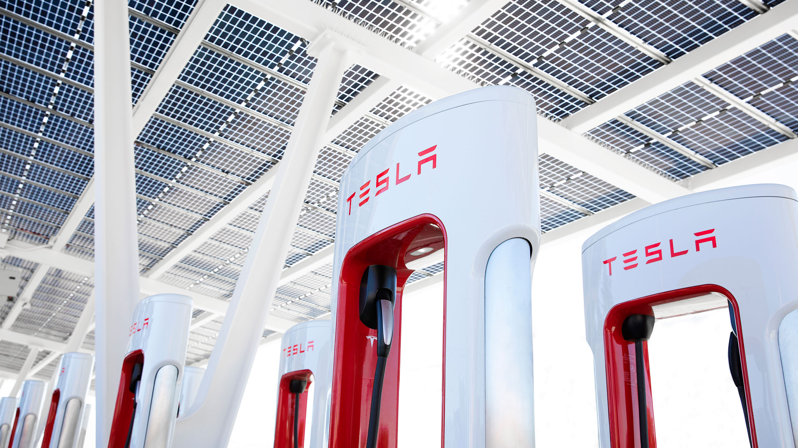

# Supercharger Location Analysis

## Objective
A group project for visualization of supercharger stations in California to navigate best locations to implement supercharger stations based on current saturations and EV populations.

## Team Members
Charissa Hoxie 
Toshi Torihara 
Michael Farm 

## Tools Used:
`Python`
`Flask`
`JavaScript`
`Leaflet`
`D3`
`Plotly`
`HTML/CSS`
`MongoDB`

## Data Source: 
https://developer.nrel.gov/docs/transportation/alt-fuel-stations-v1/all/ 
https://afdc.energy.gov/data/search?q=electricity 

## Extract, Transform, Load (ETL)
### Part I - 

### Part II - 

### Part III - Flask App and Webscraping
* Utilized Flask app to connect `MongoDB` with different Tesla models to show the popularity of supercharger EVs in general 
* Get information (make, model, price, and images) of Tesla models by web-scraping off of [Carvanas](https://www.carvana.com/cars/tesla)
* Generate [Tesla Scraper](https://github.com/toshitorihara/project3/tree/main/Images/tesla_scraper.png) to display above data in one single html site

## Initial Requirements
* Your visualization must include a Python Flask–powered API, HTML/CSS, JavaScript, and at least one database (SQL, MongoDB, SQLite, etc.). 
* Your project should fall into one of the below three tracks: 
    * A combination of web scraping and Leaflet or Plotly 
    * A dashboard page with multiple charts that update from the same data 
    * A server that performs multiple manipulations on data in a database prior to visualization (must be approved) 
* Your project should include at least one JS library that we did not cover. 
* Your project must be powered by a dataset with at least 100 records. 
* Your project must include some level of user-driven interaction (e.g., menus, dropdowns, textboxes). 
* Your final visualization should ideally include at least three views.
